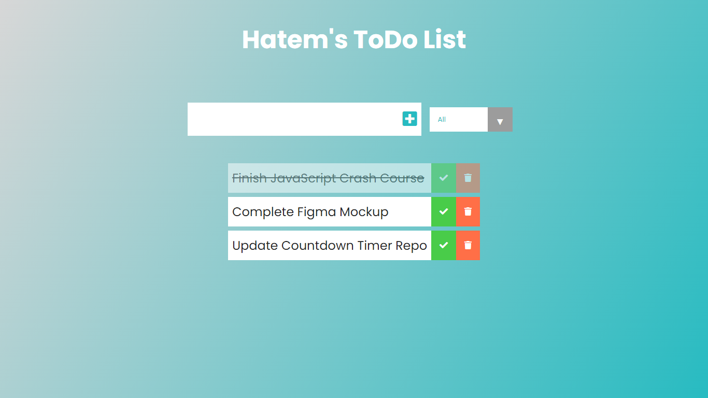

# Project Title

To Do App

## Description

The main purspose for this project was is to test my Vanilla JavaScript skills in creating simple yet useful and fun app.

## Preview

## Getting Started

### Dependencies

* HTML, CSS and Vanilla JavaScript

### Installing

* Download the "index" HTML file, "style" CSS file and "app" JavaScript file - no additional packages or files needed.

### Executing program

* Make sure to download all files mentioned above with the assets folder and put them in a folder
* Open VSCode and open a new workspace and add that folder you just created.
* Voila! Run the code and enjoy the functionality!
```
code blocks for commands
```

## Help

Any advise for common problems or issues.
```
command to run if program contains helper info
```

## Authors

Contributors names and contact info

ex. Hatem   
ex. [@codenkoffee](https://www.instagram.com/codenkoffee/)

## Version History

* 0.2
    * Various bug fixes and optimizations
    * See [commit change]() or See [release history]()
* 0.1
    * Initial Release

## License

This is an open source project - no use restrictions.